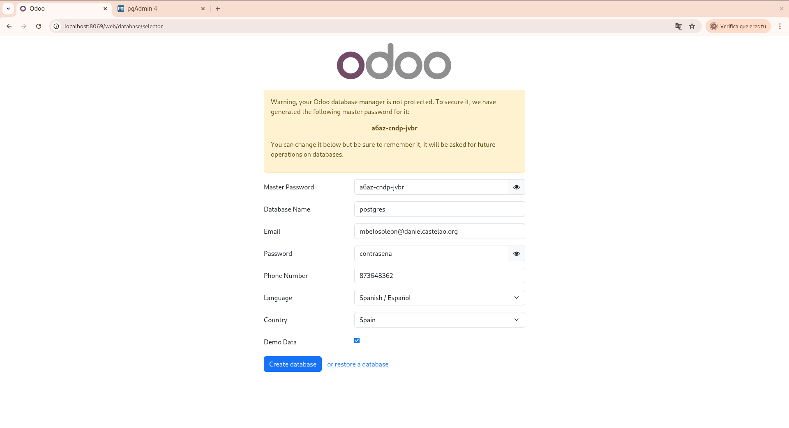
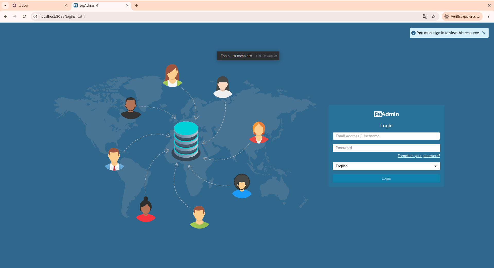
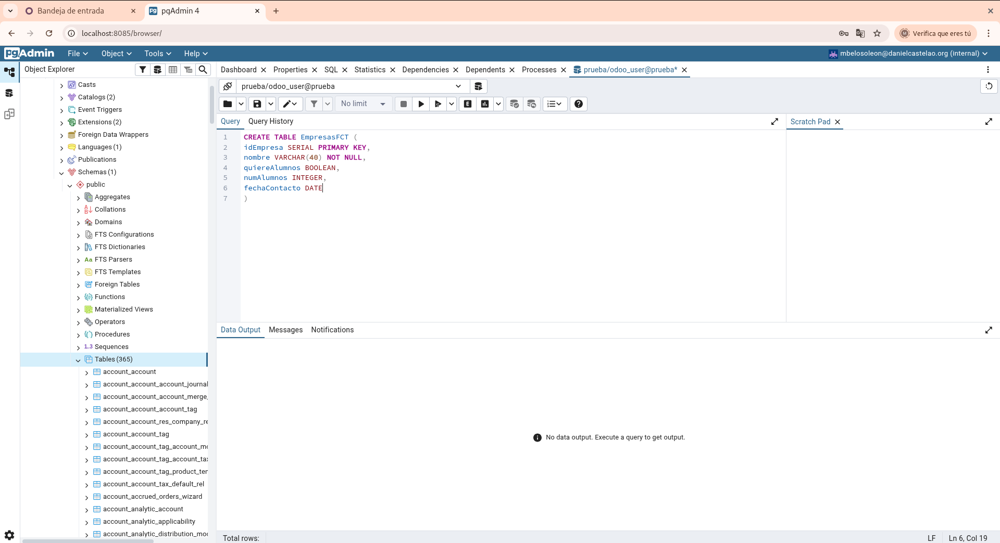
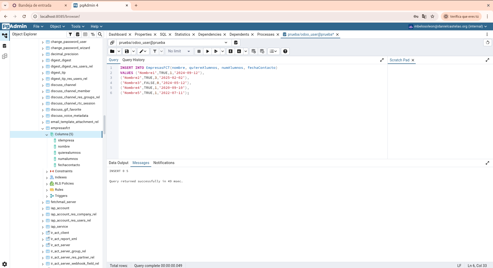
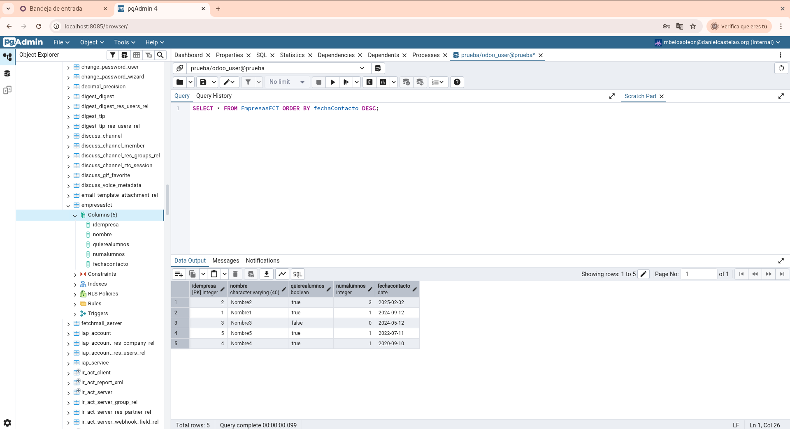
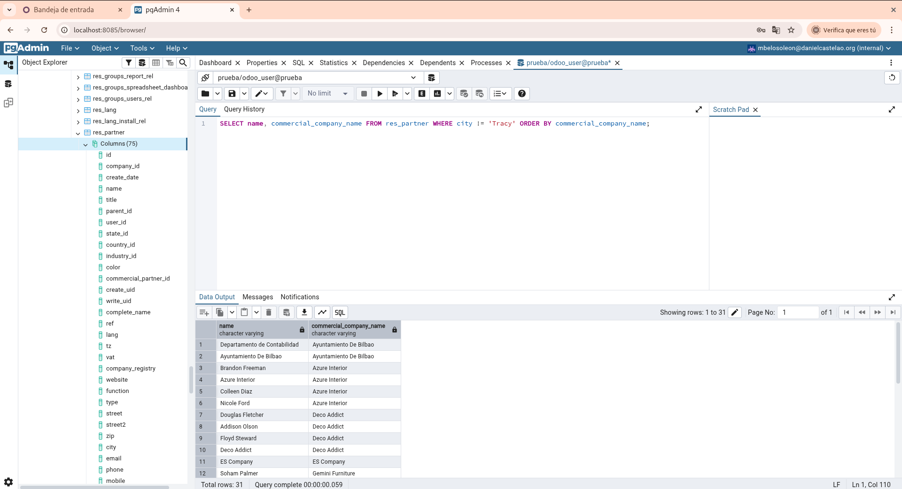
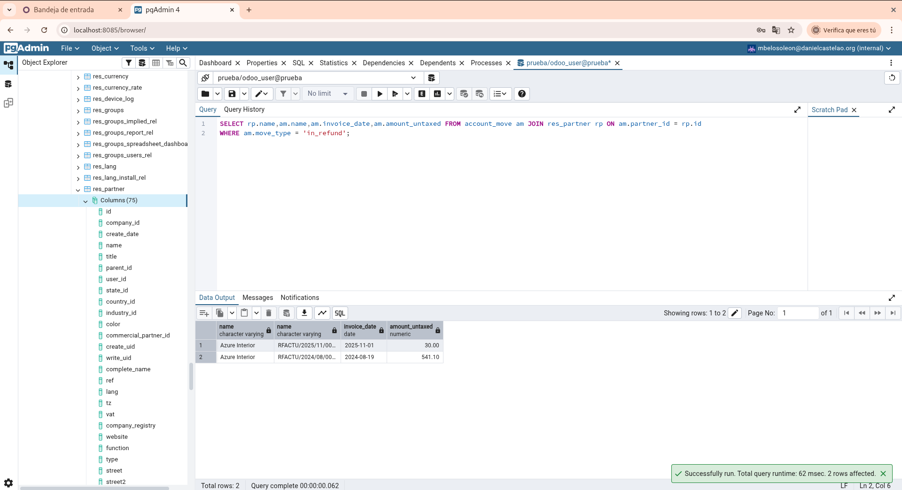
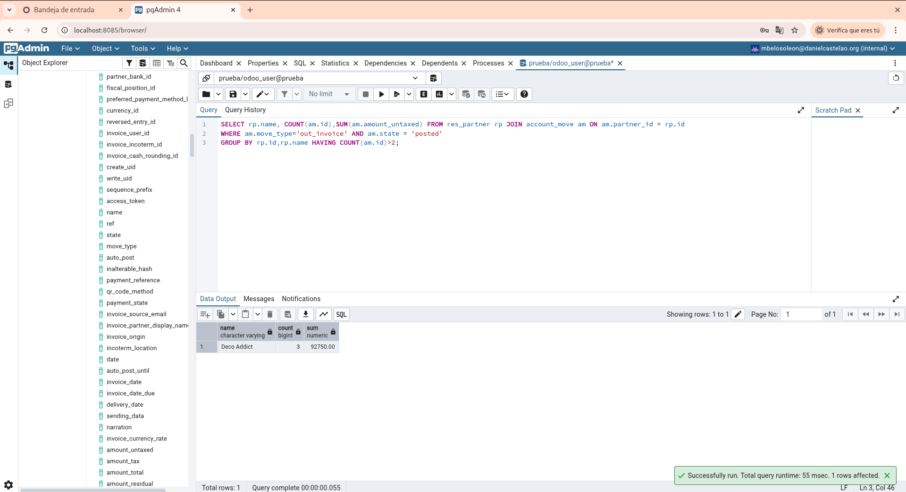
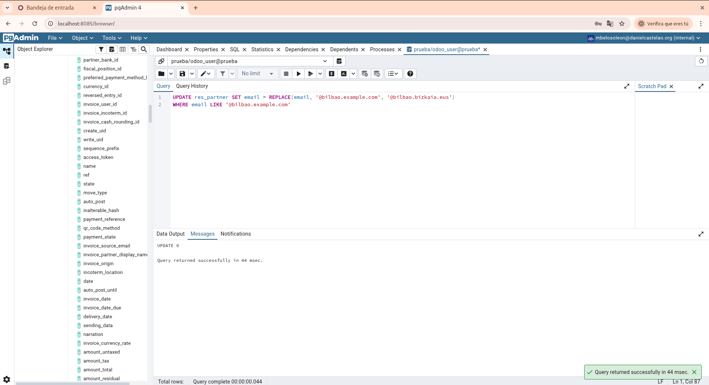

Creamos un documento docker-compose.yml para ejecutar los servicios de Odoo y de pgAdmin, para poder consultar la base de datos de Odoo.

Al acceder a los puertos correspondientes, nos lleva a las páginas de Odoo y de pgAdmin

A través de la página de Odoo, rellenamos los campos y creamos la base de datos, seleccionando la opción "Demo Data"

Después de crearla podemos acceder a ella a través de pgAdmin.

En pgAdmin, debemos crear una nueva conexión al servidor de la base de datos para conectarnos a ella.
Después de esto podemos ver nuestras bases de datos instaladas anteriormente desde Odoo(Facturación y Consultas).

Apartado 1:

En nuestra base de datos, creamos una nueva tabla llamada "EmpresasFCT", y la completamos con los elementos requeridos.

Apartado 2:

Insertamos cinco registros inventados en la tabla nueva

Apartado 3:

Realiza una consulta donde se muestren todos los datos de la tabla ordenados por fechaContacto, de modo que en la primera fila salga el que tenga la fecha más reciente

Apartado 4:

Realiza una consulta que permita obtener un listado de todos los contactos de Odoo con la siguiente información:
Nombre
Cuya ciudad NO sea Tracy
Nombre comercial de la empresa
Ordenados alfabeticamente por el nombre comercial de la empresa

Apartado 5:

Obtén un listado de empresas proveedoras, que han emitido algún reembolso:

Nombre de la empresa
Número de la factura
Fecha de la factura
Total factura SIN impuestos

Ordenadas por fecha de factura de modo que la primera sea la más reciente

Apartado 6:

Obtén un listado de empresas de clientes, a las que se les ha emitido más de dos facturas de venta confirmadas, mostrando los siguientes datos:

Nombre de la empresa
Número de facturas
Total facturado SIN IMPUESTOS

Apartado 7:

Crea una sentencia que actualice el correo de los contactos cuyo dominio es @bilbao.example.com a @bilbao.bizkaia.eus

